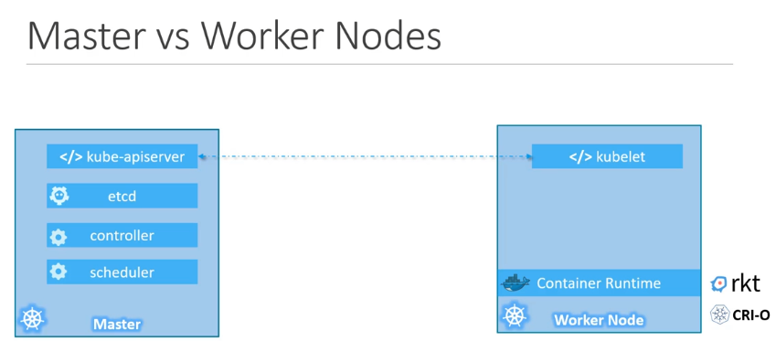

## Core Concepts 
- Nodes 
  - Is a machine on which K8s is installed
  - Its can be  physical or virtual 
  - Node: 
      - Is a worker machine and that is where containers are launched by K8s
      - It was also called as Minions in the past
      - If the node on which the application is running fails, then obviously application goes down.
      - So we need more than one node
- Cluster: 
  - Its a set of nodes grouped together
  - This way even if a node fails, you have your applicaiton till accessible from other nodes 
  - Having multiple nodes helps in sharing the loads
  - Responsibility of a cluster: 
    - Managing the cluster
      - Information of the members of the cluster stored
      - How are nodes monitored ?
      - How do we move the workloads of the failed node to another worker node ?
      - MAster comes in here !
  - Master is another node, K8s installed in it and confiruged as a master 
  - it watches over the nodes in the clusters and responsbiole for the actual orchetration of the containers on the worker nodes.
- When K8s in installed on a system the following components are installed 
  - API server 
    - Acts as frontend for K8s, the users management devices, command line interfaces all talk to the API server to interact with k8s cluster
  - etcd 
    - Etcd is a distrubuted , reliable key value store used by k8s to store all data used to manage the cluster. 
    - Think of it this way when you have multiple nodes and multiple masters in your cluster, etcd stores all that information on all the nodes in the clsuter in a distrubuted manner.  
    - Etcd is responsbile for implementing locks within the cluster to ensure that there are no conflicts between the masters. 
  - Kubelet 
    - An agent running on each node in the cluster.
    - The agent is responsbile for making sure that the containers are running on the nodes as expected. 
  - container runtime 
    - Its underlying software that is used to run containers. In our case its docker but there are other options as well. 
  - controller 
    - They are the brain behind the orchestration
    - They are responsbile for noticing and responding  when nodes and containers or endpoints goes down. 
    - The controllers make decisions to bring up new containers in such cases. 
  - scheduler 
    - Its responsbile for distributing work or containers across multiple nodes.
    - It looks for newly created containers and assings them to nodes.
- How does on become master or slave 
  - Slave:
    - Places where containers are hosted and for docker cotnainers on a system, we need `container runtime` installed.
    - Thats where the container runtime falls. 
    - Worked node has kubelet agent, that is responsible for interacting with a master to provide health information of the worker node and carry out actions requested by the master on the worker nodes.
  - Master: 
    - Master server has Kube-apiserver  
  
- kubectl 
  - kube control is used to manage applications on a k8s cluster to get cluster infromation and status of other nodes
  - `kubectl run hello-minikube` is used to deploy an application 
  - `kubectl cluster-info` is used to view information about the cluster 
  - `kubectl get nodes` is used to get all the nodes part of the cluster

